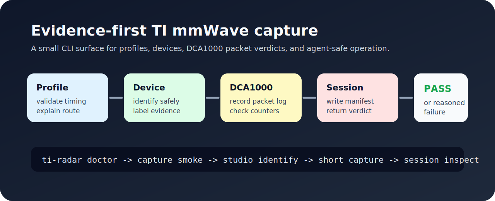

<h1 align="center">
  
  <br />
  ti-radar-cli
</h1>

<p align="center">
  <strong>面向 TI mmWave 雷达采集的可靠优先 CLI 和 Agent Skill。</strong>
</p>

<p align="center">
  <strong>检查硬件状态</strong> ·
  <strong>记录 packet verdict</strong> ·
  <strong>让 Agent 安全操作</strong>
</p>

<p align="center">
  <a href="https://github.com/Zhenyu98/ti-radar-cli/stargazers"></a>
  <a href="LICENSE"></a>
  <a href="https://www.python.org/"></a>
</p>

<p align="center">
  <a href="#这个项目解决什么">Why</a> ·
  <a href="#快速开始">快速开始</a> ·
  <a href="#agent-使用">Agent 使用</a> ·
  <a href="#设备验证等级">设备验证</a> ·
  <a href="#faq">FAQ</a> ·
  <a href="README.md">English</a>
</p>

<p align="center">
  
</p>

## 这个项目解决什么

TI 雷达采集经常卡在硬件状态边界：雷达身份、固件路线、COM 口、RSTD、mmWave Studio 启动上下文、DCA1000 网口、LVDS 布局、packet log 和 raw bin 验证。

`ti-radar-cli` 把这些易错状态变成可检查、可记录、可复现的命令，让人和 Agent 都能按证据推进。

| 手动 bring-up | 使用 `ti-radar-cli` |
|---|---|
| 靠记忆复现 GUI 步骤。 | 运行具名预检和采集命令。 |
| 只看 raw bin 是否存在。 | 读取带 packet counters 和 verdict 的 manifest。 |
| 让 Agent 猜 Lua 或硬件顺序。 | 给 Agent 一个带审批闸门和安全默认值的 skill。 |
| 笼统声称支持硬件。 | 用 `verified`、`scaffold`、community evidence 标注路线等级。 |

## 快速开始

```powershell
git clone https://github.com/Zhenyu98/ti-radar-cli.git
cd ti-radar-cli
python -m pip install -e .
ti-radar version
ti-radar doctor
ti-radar capture smoke --backend mock
ti-radar session inspect latest
```

预期成功信号：

```text
ti-radar version 输出包和 Python 信息
ti-radar doctor 完成检查且不启动采集
capture smoke 写出 mock session
session inspect latest 能读取 manifest.yaml
```

可选硬件依赖：

```powershell
python -m pip install -e ".[studio,serial,plot]"
```

`pythonnet` 用于 RSTD 控制，`pyserial` 用于增强 COM 口检查，`matplotlib` 用于 quicklook 图。

## Agent 使用

把这段发给 Codex、Claude Code、Cursor 或其他 coding agent：

```text
Read https://github.com/Zhenyu98/ti-radar-cli/blob/main/agent-setup.md and follow it to install and configure ti-radar-cli for me.
Goal: inspect the environment first, run the non-hardware smoke path, and ask before hardware state changes.
```

Agent guide 会指向 `README.md` 和 `skills/ti-radar/SKILL.md`，并从 `ti-radar version`、`ti-radar doctor`、`ti-radar capture smoke --backend mock`、`ti-radar session inspect latest` 开始。

## 硬件预检

只检查，不采集：

```powershell
ti-radar doctor --profile default_6843
ti-radar studio status
ti-radar studio ping
ti-radar studio identify
```

短帧 pilot 采集需要用户明确同意硬件状态变化：

```powershell
ti-radar studio run --profile default_6843 --frames 10
ti-radar session inspect latest
```

## CLI 分层

顶层 help 保持简洁：

```text
version
doctor
studio    Expert backend commands
capture
session
device
```

专家命令在：

```powershell
ti-radar studio --help
```

常用命令：

```powershell
ti-radar doctor
ti-radar capture smoke --backend mock
ti-radar capture raw --backend studio --profile default_6843 --frames 10
ti-radar session list
ti-radar session inspect latest
ti-radar device route --part-id 6843
```

## 设备验证等级

硬件覆盖按证据等级标注。

| 设备/profile | 路线 | 验证等级 | 证据要求 |
|---|---|---|---|
| `default_6843` / xWR6843-style route | mmWave Studio + RSTD + DCA1000 | 作者实验室路线 `verified` | 短帧采集、manifest、DCA packet verdict 均通过 |
| 其他 xWR/AWR/IWR 路线 | device decode scaffolds | `scaffold` | 来自 TI 路由语义，需要贡献者提供 packet-log 证据后再提升等级 |

默认 DCA1000 网络参数：

```text
PC DCA 网卡: 192.168.33.30/24
DCA1000 FPGA: 192.168.33.180
命令端口:     4096
数据端口:     4098
```

新机器采集前先跑 `ti-radar doctor`。

## Session Verdict

真实采集会写 `manifest.yaml`：

```yaml
verdict: pass
failure_reasons: []
```

fail 条件包括：缺 raw bin、bin 太小、缺 DCA packet log、received packets 为 0、乱序、zero-filled packet/byte。

## FAQ

**没有硬件可以跑吗？**

可以。使用 `ti-radar capture smoke --backend mock` 和 `ti-radar session inspect latest` 跑无硬件路径。

**`ti-radar studio identify` 会启动 RF 或采集吗？**

它通过 RSTD 读取 device identity，流程应避开固件下载、RF enable 和 `StartFrame`。

**什么样的采集才算可用？**

manifest verdict 通过，raw bin 大于最小阈值，received packets 大于 0，out-of-sequence 和 zero-filled 计数为 0。

## 致谢

本项目参考 TI 公开的 mmWave Studio、DCA1000 和 radar toolbox 概念。TI 二进制文件和私有实验数据留在仓库之外。

## Contributing

欢迎 issue 和 pull request。报告硬件行为时尽量附上 device/profile、backend、命令行、manifest verdict 和 packet-log counters，并清理日志与截图中的隐私信息。

## License

MIT License. See [LICENSE](LICENSE).

## Star History

<a href="https://www.star-history.com/#Zhenyu98/ti-radar-cli&Date">
  <picture>
    <source media="(prefers-color-scheme: dark)" srcset="https://api.star-history.com/svg?repos=Zhenyu98/ti-radar-cli&type=Date&theme=dark" />
    <source media="(prefers-color-scheme: light)" srcset="https://api.star-history.com/svg?repos=Zhenyu98/ti-radar-cli&type=Date" />
    
  </picture>
</a>
